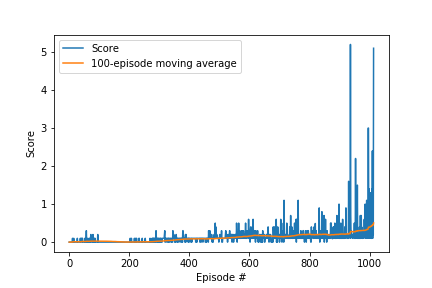

## Deep reinforcement learning: Collaboration and Competition

### Goal

In this environment **two agents** control rackets to bounce a ball over a net.

The **state space** has 8 local observations per agent on the position and velocity of the ball and racket.

The **action space** has 2 continous dimensions per agent, corresponding to movement toward (or away from) the net, and jumping. 

A **reward** of +0.1 is provided to the agent if it hits the ball over the net. If an agent lets a ball hit the ground or hits the ball out of bounds, it receives a reward of -0.01. The task is episodic. 
 
The problem is considered solved when agents get an average score of at least +0.5 (over 100 consecutive episodes, after taking the maximum over both agents). 

### Methods
This solution uses the [Muti-Agent Deep Deterministic Policy Gradient](https://papers.nips.cc/paper/7217-multi-agent-actor-critic-for-mixed-cooperative-competitive-environments.pdf) Actor-Critic algorithm for continuous control problems with two agents a simple (unweighted) replay buffer. 

#### Actor network architecture
The input into the network is a state vector of length 16. There are 2 output nodes with values between (-1, 1), corresponding to the each action dimension. The network has three fully connected layers. 

| Layer | Dimensions | Activation |
|:-----:|:----------:|:----------:|
|   FC-1   |\[16, 256\]        |        |
|   FC-2   |\[256, 256\]      | ReLU       |
|   FC-3   | \[256, 2\]        |    tanh        |

#### Critic network architecture
The input into the network is a state vector of length 16, concatenated with 2 values describing each agent's action *a* in the second layer. The output is a single value, corresponding to *Q(s,a)*. The network has three fully connected layers and with 10% dropout layers after the first and second fully connected layers. 

| Layer | Dimensions | Activation |
|:-----:|:----------:|:----------:|
|   FC-1   |\[16, 256\]        |    ReLU    |
| Dropout-1 | | p=10% |
|   FC-2   |\[256 + 4, 256\]      | ReLU       |
| Dropout-2 | | p=10% |
|   FC-3   | \[256, 1\]        |    None        |

See `model.py` for the detail of the network achitectures in PyTorch. 

#### Parameters

The solution, as implemented and saved in the accompanying `checkpoint_actor_x.pth` and `checkpoint_critic_x.pth` files, was obtained with the following parameters:

| Parameter | Value |Explanation |
|:-----|:----------|:----------|
|BUFFER_SIZE | int(1e6) |replay buffer size|
|BATCH_SIZE | 256        | minibatch size|
|BUILD_BUFFER| 100| the number of episodes of taking random actions to build up the replay buffer
|GAMMA | 0.99           | discount factor|
|TAU | 7e-3              |for soft update of target parameters|
|LR_ACTOR | 1e-4                |learning rate of the actor |
|LR_CRITIC | 2e-4                |learning rate of the critic |
|WEIGHT_DECAY | 0 | L2 weight decay|
|LEARNING_FREQ | 1       | how often to update the network|
| N_UPDATES| 1| how many times to sample the replay buffer in each learning step |
|EPSILON | 1.0         | $\epsilon$ noise parameter|
|EPSILON_DECAY|   1e-6         | decay in $\epsilon$ per step|
|EPSILON_MIN|0.99          | the minimum value of $\epsilon$ |
|max_t | 2000| maximum number of steps per episode
|ADD_NOISE| True| whether to add action noise for exploration|

The noise is generated by an Ornstein-Uhlenbeck process with $\mu =0$, $\theta = 0.15$ and $\sigma = 0.2$

### Results

This implementation takes 1014 episodes to solve the enviroment by reaching an average score of +0.5 over 100 consecutive episodes. The score in each episode is itself a maximum score across the two agents.  

    Episodes 0-10	Max Reward: 0.000	Moving Average: 0.000
    Episodes 100-110	Max Reward: 0.000	Moving Average: 0.025
    Episodes 200-210	Max Reward: 0.100	Moving Average: 0.002
    Episodes 300-310	Max Reward: 0.100	Moving Average: 0.027
    Episodes 400-410	Max Reward: 0.100	Moving Average: 0.086
    Episodes 500-510	Max Reward: 0.300	Moving Average: 0.104
    Episodes 600-610	Max Reward: 0.400	Moving Average: 0.167
    Episodes 700-710	Max Reward: 0.600	Moving Average: 0.144
    Episodes 800-810	Max Reward: 0.400	Moving Average: 0.198
    Episodes 900-910	Max Reward: 0.500	Moving Average: 0.211
    Episodes 1000-1010	Max Reward: 2.400	Moving Average: 0.454
    <-- Environment solved in 1014 episodes!             
    <-- Moving Average: 0.504 over past 100 episodes

The figure below illustrates the convergence to the solution:

### Potential areas for further work

Futher options to explore include:

1. Adding the [prioritised experience replay](https://ieeexplore.ieee.org/document/8122622) to the DDPG implementation. 

2. Carry out more systematic hyperparameter tuning to explore whether it increases the stability of the solution. 

3. Investigate whether batch normalisation is could be a valid addition to this model and would improve performance. 

4. Add [parameter space noise](https://openai.com/blog/better-exploration-with-parameter-noise/) to improve exploration. 

